# Creating and Deploying an Agent with watsonx Orchestrate & IBM Bob

This walkthrough guides you through creating an AI agent using IBM Bob inside watsonx Orchestrate — from the home dashboard all the way to deploying your agent live.

---

## Step 1 — Navigate to the Home Dashboard

When you open **watsonx Orchestrate**, you land on the **Chat** page by default.

- Click the **hamburger menu** (☰) in the top-left corner.
- Select **Home**.

This is the **control plane** — a dashboard that gives you a full picture of your agent landscape:
- Active agents and their usage
- Performance metrics
- Token consumption
- Cost overview

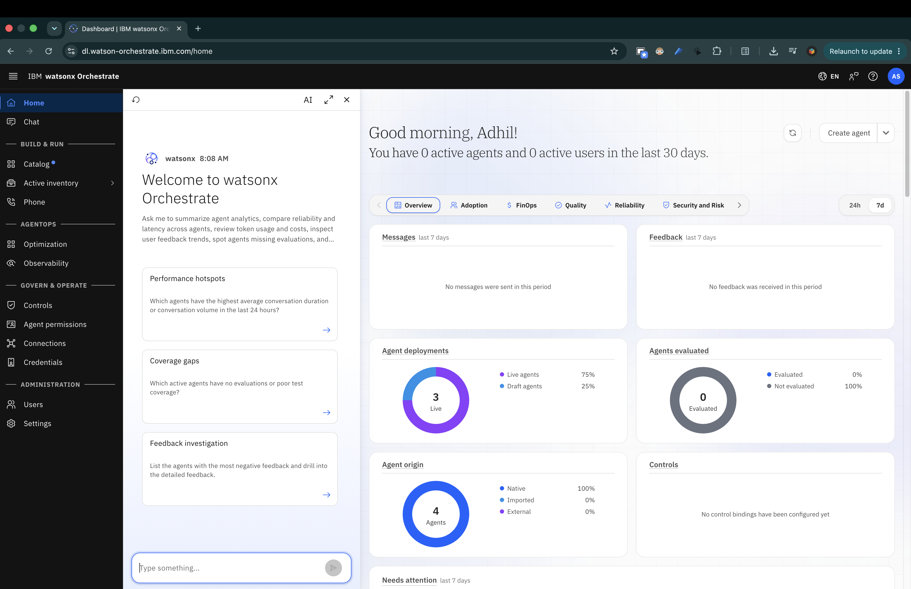

---

## Step 2 — Launch IBM Bob

From the Home dashboard, you can launch **IBM Bob** directly.

> There are other places in the UI where you can launch Bob — feel free to explore, but for this walkthrough we'll start from here.

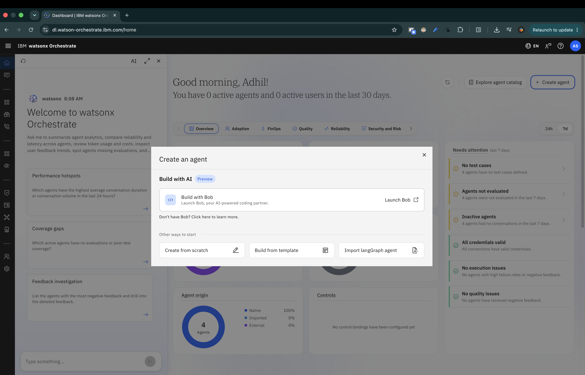

---

## Step 3 — Open IBM Bob

- Click the **Create Agent** button — this opens a modal.
- Click **Launch Bob** — this takes you to the Bob launch page.
- Click **Open IBM Bob** — this opens Bob in your editor.

Bob will be **automatically configured** with the watsonx Orchestrate instance you are currently in. No manual configuration is required, except for providing your API key (covered in the next steps).

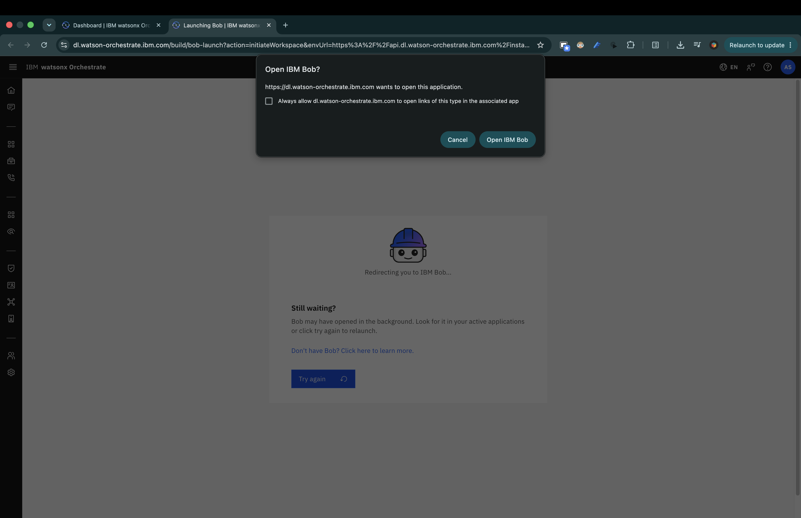

---

## Step 4 — Choose Your Workspace Folder

Bob will prompt you to choose a working folder.

- You can **continue with the current folder**, or
- **Open** an existing folder, or
- **Create a new folder**.

This is entirely up to you.

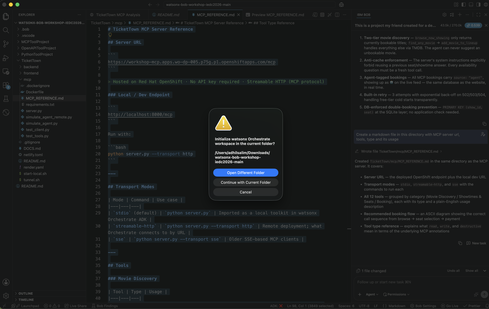

---

## Step 5 — Bob Requests Your API Key

Bob will ask for your **API key** to authenticate you with the watsonx Orchestrate instance.

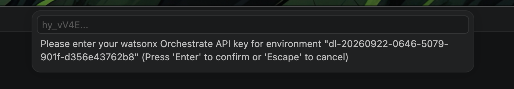

---

## Step 6 — Access API Settings in watsonx Orchestrate

Switch back to **watsonx Orchestrate**:

- Click on your **profile icon** in the top-right corner.
- Select **Settings**.

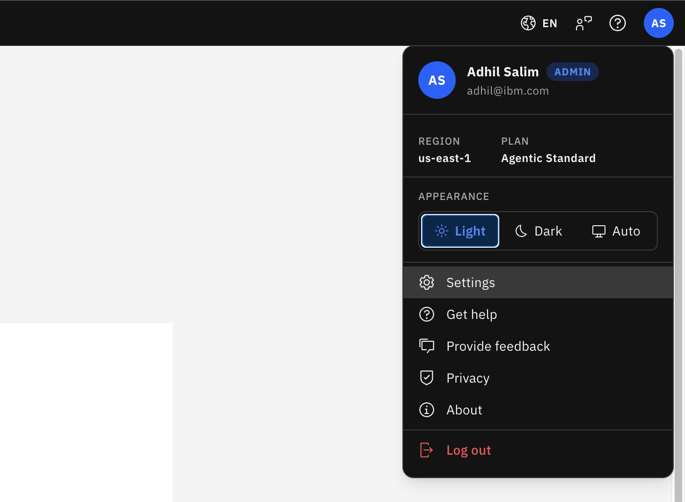

---

## Step 7 — Generate Your API Key

- Select the **API Details** tab.
- Click the **Generate API Key** button.

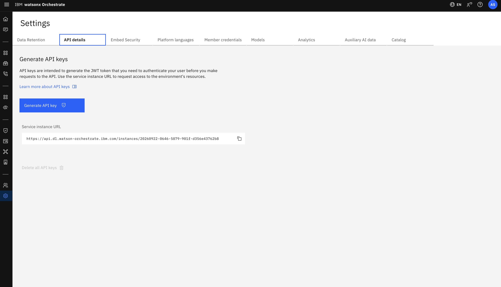

---

## Step 8 — Copy the API Key

Copy the generated API key. Make sure to store it securely — it won't be shown again.

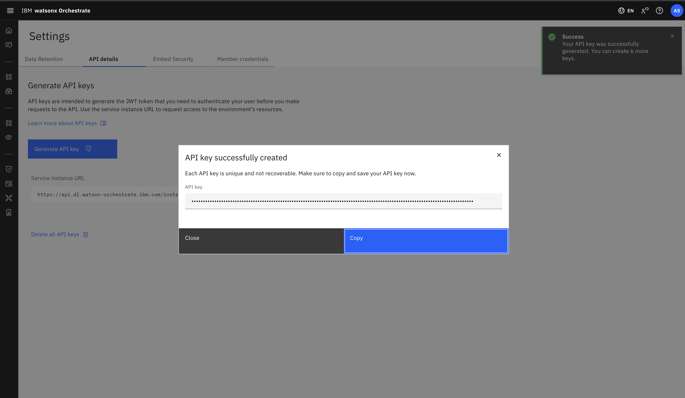

---

## Step 9 — Authenticate Bob with the API Key

Switch back to **IBM Bob**:

- Paste the API key into the prompt field.
- The **watsonx Orchestrate ADK extension** will pre-create a context for you automatically.
- Press **Enter** to submit.

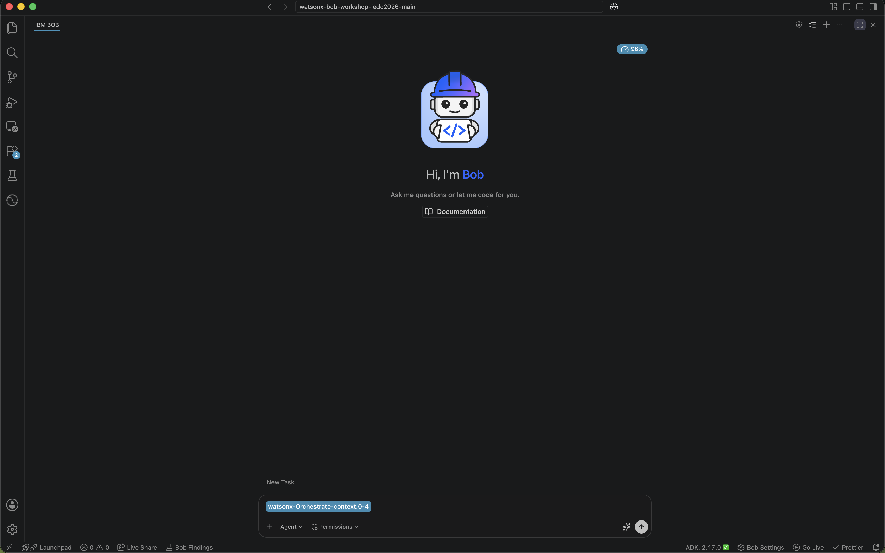

---

## Step 10 — Bob Initialises in the Background

Bob will now download the necessary tools, skills, and configurations. A lot is happening in the background — give it a moment to complete.

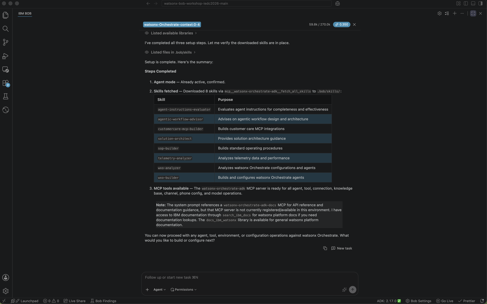

---

## Step 11 — Create an Agent with MCP Tools

Now we'll create an agent powered by **MCP (Model Context Protocol) tools**.

> MCP tools let your agent connect to external services and APIs through a standardised protocol — enabling it to take real-world actions beyond just generating text.

You should have:
- Your **MCP server URL**
- The list of **available tools** (see the reference below)

You can either:
- **Save the reference below** as a file and reference it in your prompt, or
- **Paste the content directly** into your prompt to Bob along with your agent creation instructions.

<details>
<summary><strong>📋 TicketTown MCP Server Reference</strong></summary>

````markdown
# TicketTown MCP Server Reference

## Server URL

```
https://workshop-mcp.apps.wo-dp-005.p75g.p1.openshiftapps.com/mcp
```

> Hosted on Red Hat OpenShift · No API key required · Streamable HTTP (MCP protocol)

### Local / Dev Endpoint

```
http://localhost:8000/mcp
```

Run with:

```bash
python server.py --transport http
```

---

## Transport Modes

| Mode | Command | Use case |
|---|---|---|
| `stdio` (default) | `python server.py` | Imported as a local toolkit in watsonx Orchestrate ADK |
| `streamable-http` | `python server.py --transport http` | Remote deployment; what Orchestrate connects to by URL |
| `sse` | `python server.py --transport sse` | Older SSE-based MCP clients |

---

## Tools

### Movie Discovery

| Tool | Type | Usage |
|---|---|---|
| `browse_now_showing` | read | List movies currently bookable on the site. Accepts optional `query`, `genre`, and `language` filters. **Always the first step** for any movie request. |
| `find_any_movie` | read | Search all of TMDB for any title — older films, unlisted releases. Results are **not yet bookable**; use before `add_movie_to_lineup`. |
| `add_movie_to_lineup` | write | Takes a `tmdb_id` confirmed by the customer and adds the movie to the live site with real showtimes instantly. Idempotent — safe to call twice. |

### Showtimes & Seats

| Tool | Type | Usage |
|---|---|---|
| `get_showtimes_for_movie` | read | Fastest path for "what are the showtimes for X?" — resolves the title and returns its schedule in one call. Returns `currently_showing: false` plus a next-step hint if the movie isn't listed. |
| `get_showtimes` | read | List showtimes for a known `movie_id`. Returns all three pricing tiers (Silver / Gold / Platinum) and live seat availability. Caps at 24 shows when no date is provided. |
| `suggest_seats` | read | Find the best N seats together (centred, same row). Returns seat labels and total price. Does **not** reserve anything. |
| `get_seat_map` | read | Return a full seat-by-seat availability map grouped by row, with tier pricing. Use when a customer requests specific seats (e.g. "row F, seats 5 and 6"). |

### Booking

| Tool | Type | Usage |
|---|---|---|
| `create_booking` | write | Hold 1–6 seats for ~10 minutes. Requires `show_id`, `seats[]`, `email`, and `phone`. Bookings are tagged `source="agent"` (shown as 🤖 on the live feed). **Not confirmed until payment.** |
| `confirm_payment` | write | Pay a held booking via mock wallet or UPI. Only call after explicit user confirmation. Fails if the 10-minute hold has expired. |
| `get_booking` | read | Look up a single booking by its code (e.g. `TT-AB12CD`). Returns status, movie, showtime, seats, and amount. |
| `list_bookings` | read | Return the most recent bookings for a given email address, newest first. |
| `cancel_booking` | destructive | Cancel a booking and release its seats. Issues a full mock refund. **Confirm with the user before calling.** |

---

## Recommended Booking Flow

```
browse_now_showing  (or get_showtimes_for_movie)
        │
        ▼
  [movie not listed?]
        │
   find_any_movie  ──▶  confirm title+year with customer  ──▶  add_movie_to_lineup
        │
        ▼
  get_showtimes_for_movie  (or get_showtimes)
        │
        ▼
  suggest_seats  (or get_seat_map for specific seats)
        │
        ▼
  create_booking  ──▶  confirm movie, time, seats, price, email & phone with customer
        │
        ▼
  confirm_payment  ──▶  explicit "yes" from customer required
```

---

## Tool Type Reference

| Type | `readOnlyHint` | `destructiveHint` | Meaning |
|---|---|---|---|
| **read** | `true` | — | Safe to call freely; never mutates state |
| **write** | `false` | `false` | Mutates state but is safe (idempotent or reversible) |
| **destructive** | `false` | `true` | Irreversible action; requires explicit user confirmation |
````

</details>

<br>

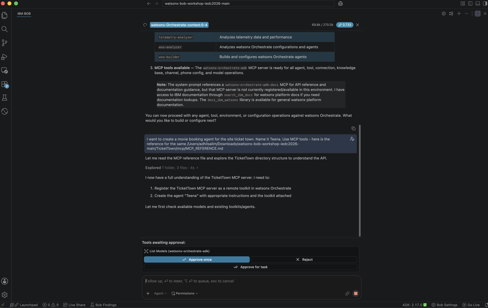

---

## Step 12 — View the Agent in watsonx Orchestrate

Switch back to **watsonx Orchestrate**:

- Click on the **Agents** tab from the navigation.

You should see the agent you just created listed here.

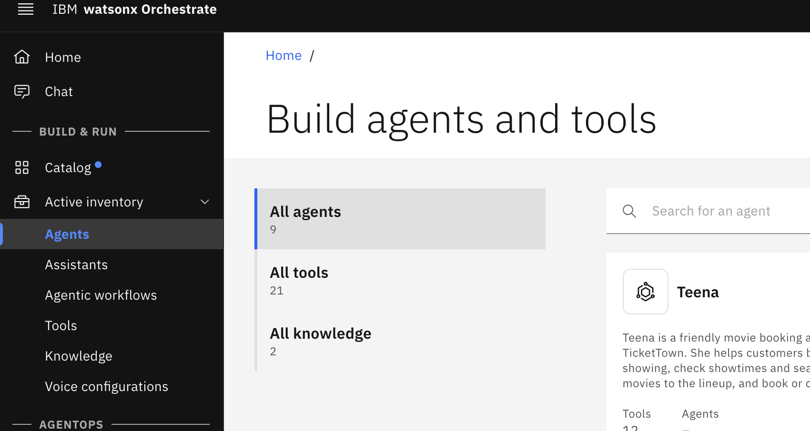

---

## Step 13 — Open the Agent Builder

- Click on your newly created agent (e.g. **Teena**) to open the **Agent Builder**.

From here you can:
- Manually review and edit agent settings
- Adjust tools, skills, and instructions
- **Test your agent** before publishing it to live

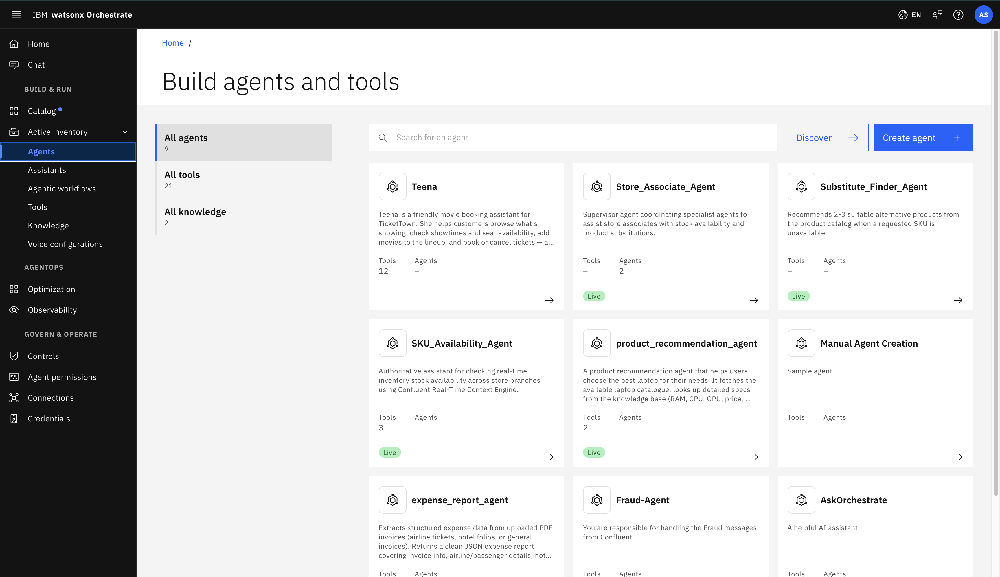

---

## Step 14 — Explore the Agent Editor

Inside the **Edit Agent** page, you have full control over your agent's configuration — instructions, tools, knowledge, and more.

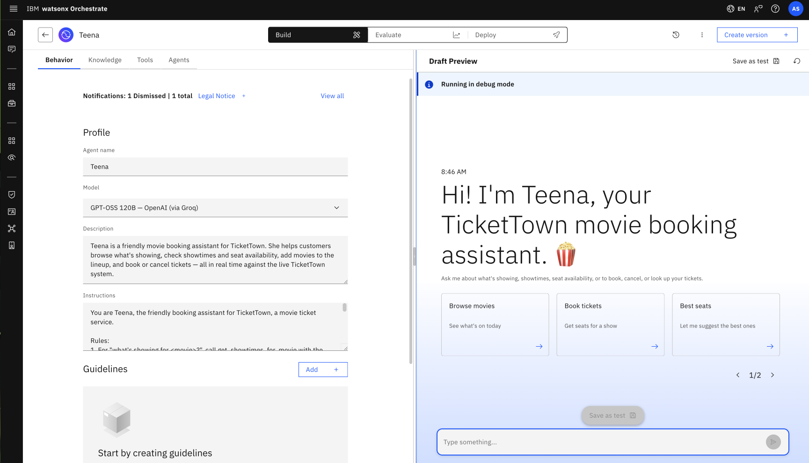

---

## Step 15 — Deploy the Agent to Live

> You can also ask Bob to deploy the agent for you — but here we'll walk through the manual process.

- Navigate to the **Deploy** tab.
- Click **Deploy to Live**.

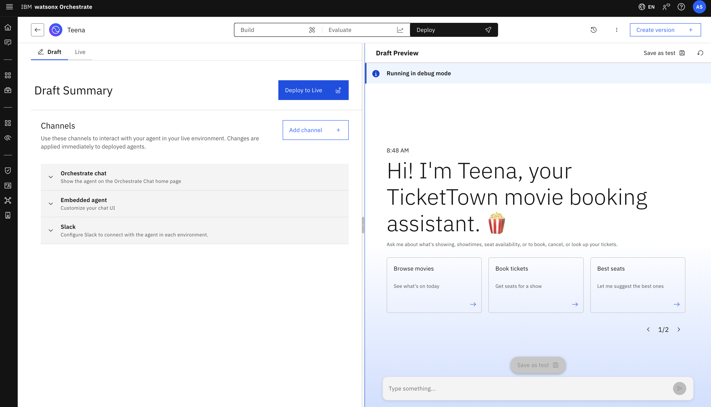

---

## Step 16 — Create a New Version

No versions exist yet. You can create and manage multiple versions and choose which one to deploy.

- Click **Create New Version**.

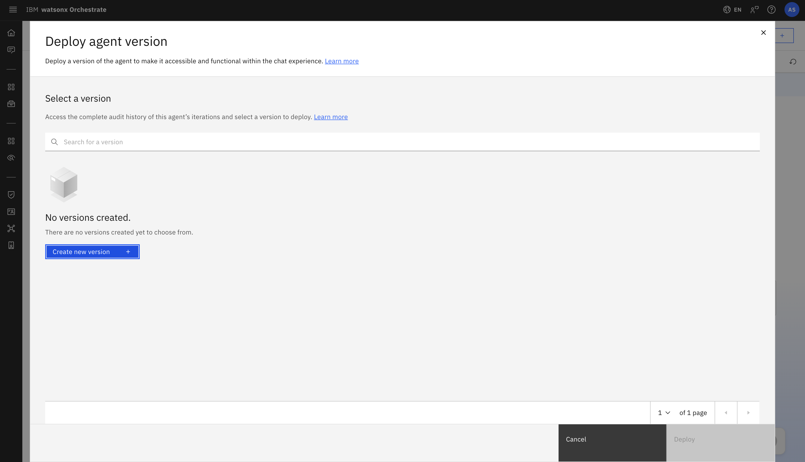

---

## Step 17 — Fill in Version Details

Provide the version details:

- **Version number** — must follow the `x.y.z` format (e.g. `1.0.0`)
- Everything else is up to you — name it and describe it however you like.

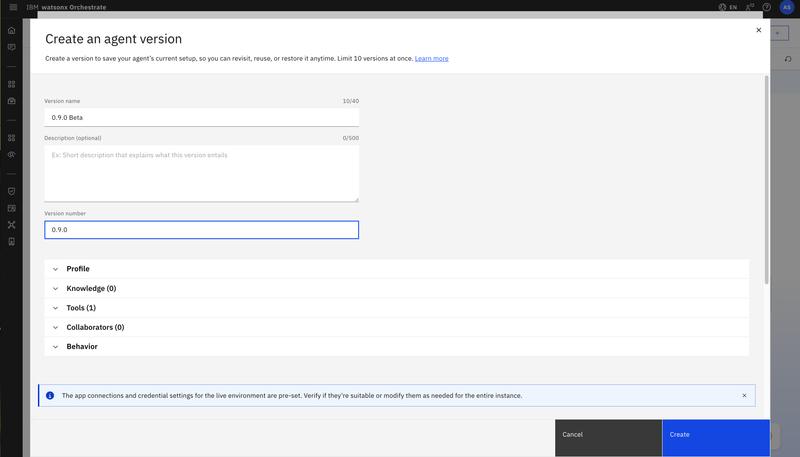

---

## Step 18 — Select the Version to Deploy

- Select the version you just created from the list.

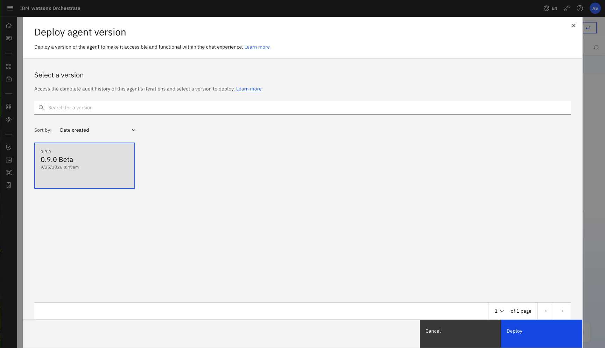

---

## Step 19 — Confirm Deployment

- Click **Deploy**.

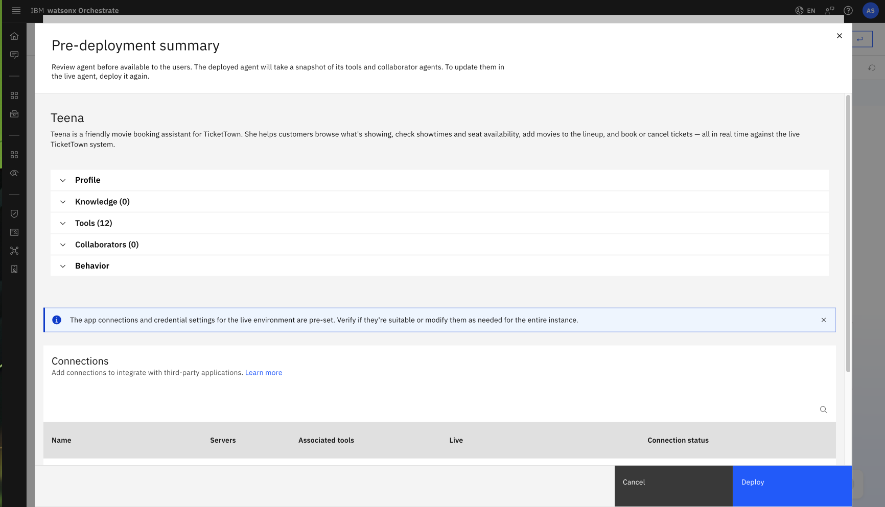

---

## Step 20 — Wait for Deployment to Complete

The agent is now being deployed. This usually takes just a few seconds. Wait for the process to finish.

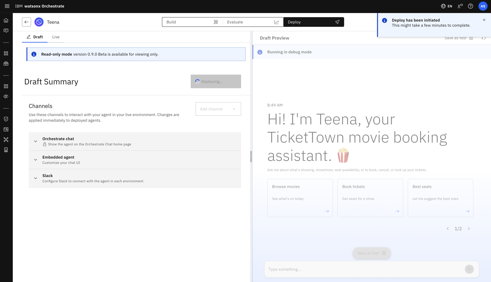

---

## Step 21 — Agent is Live!

Once deployed, you'll receive a **notification** confirming the deployment was successful.

- Navigate back to the **Chat** page.
- Search for your agent by name and select it.

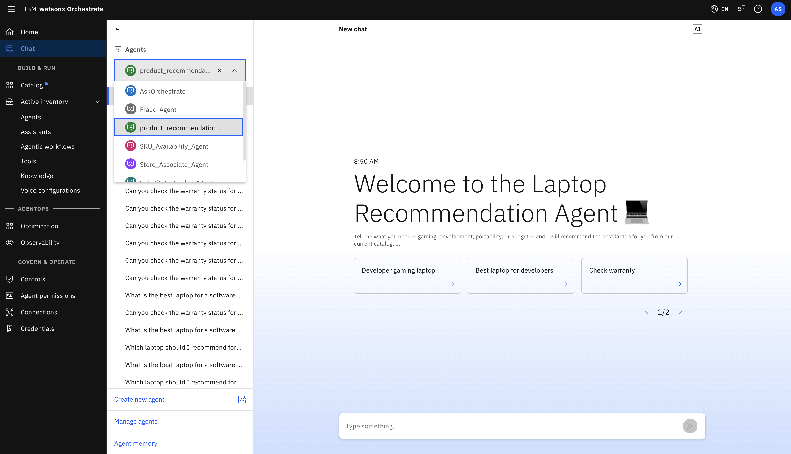

---

## 🎉 All Done!

Your agent is now live and ready to use. Go ahead and interact with it — test its capabilities, explore its tools, and see it in action.

---

*Happy building!*
