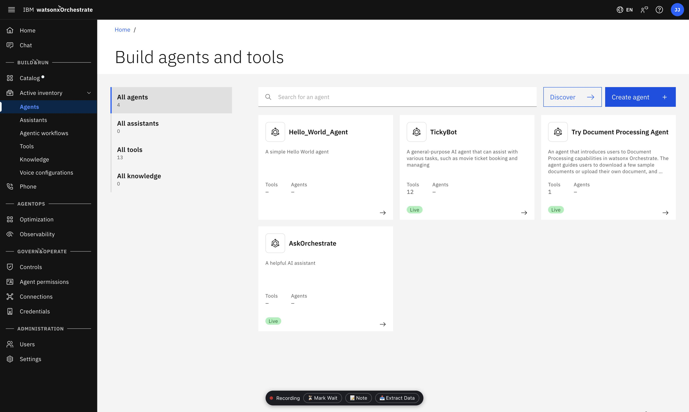
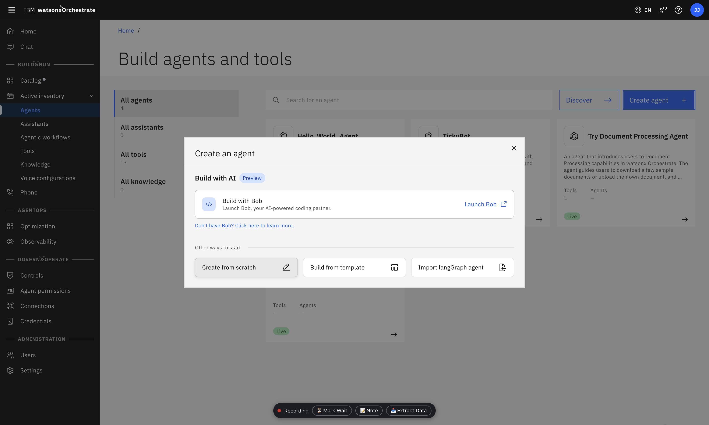
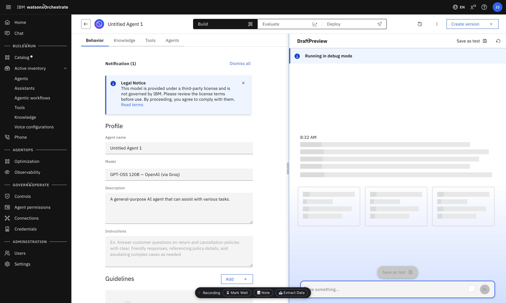
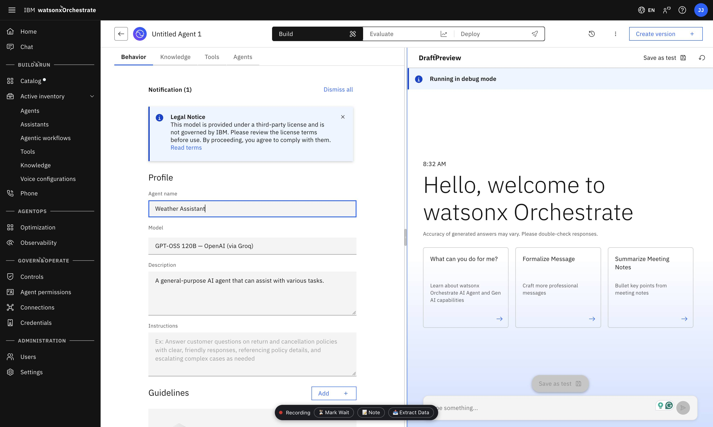
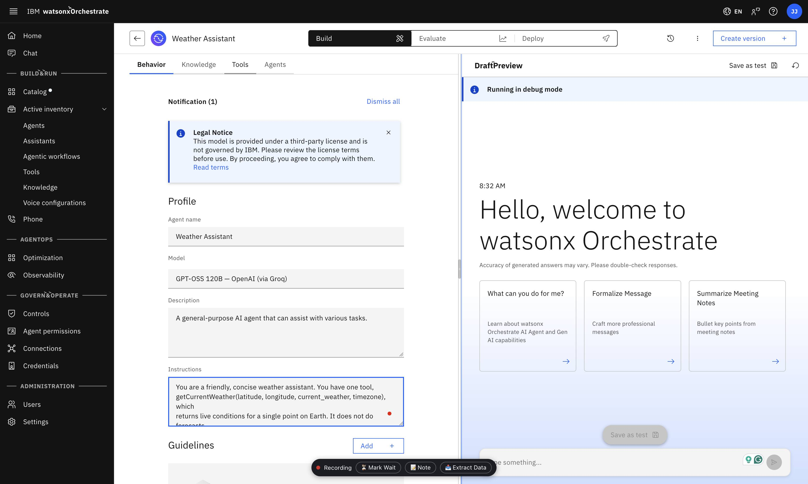
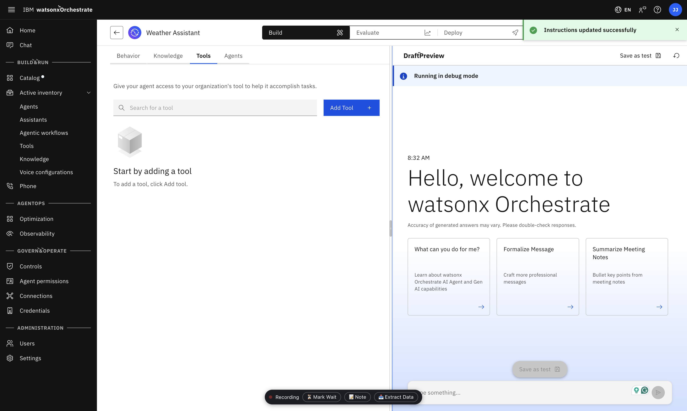
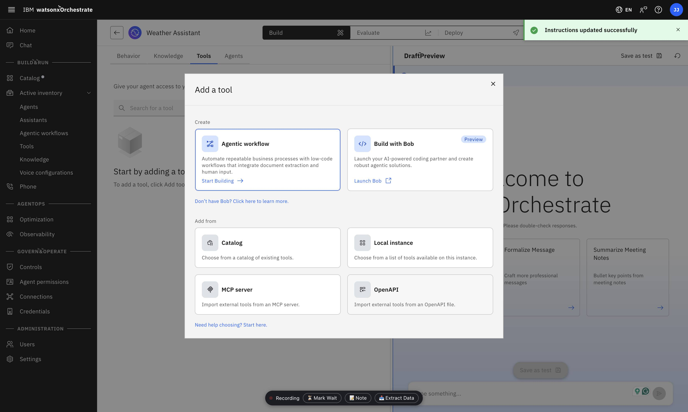
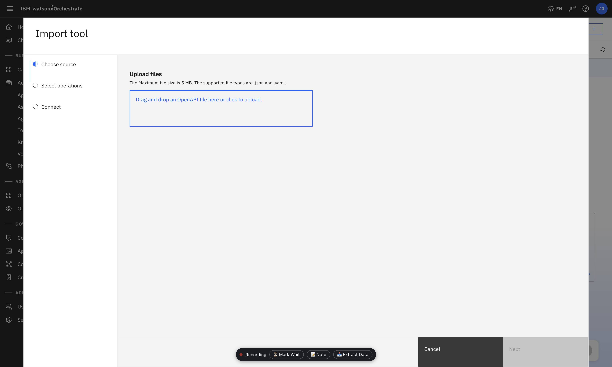
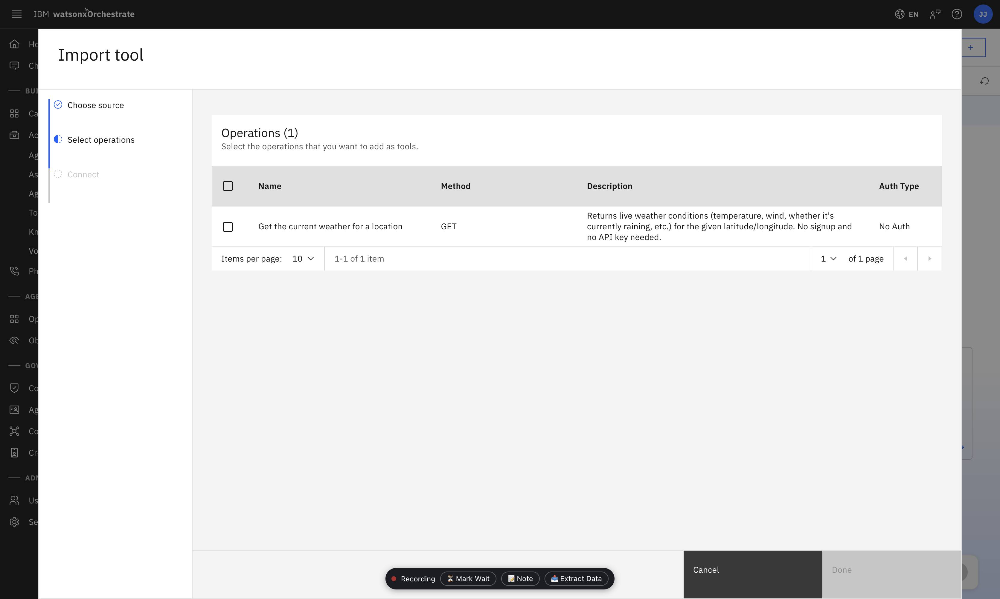
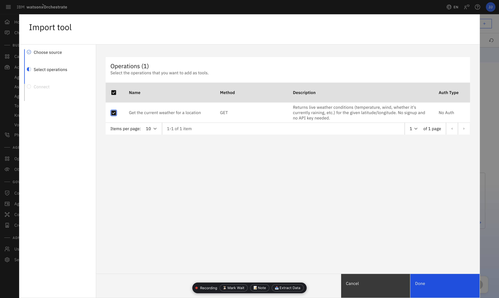

# OpenAPI Tool Project — Weather Assistant

A guided project: build an AI agent in **watsonx Orchestrate** that answers weather questions using an **OpenAPI tool**, instead of MCP. An OpenAPI tool lets Orchestrate call an external API directly from its specification, with no server to write.

**Compared to [`../TicketTown`](../TicketTown):** TicketTown required a custom MCP server because it exposes a purpose-built backend. Here, the API already exists and is public, so Orchestrate can call it directly once given its OpenAPI specification.

## The API: Open-Meteo

[Open-Meteo](https://open-meteo.com) provides free, real-time weather data for any location worldwide. No API key or signup is required.

Example request — this is the exact call the tool makes:

```bash
curl "https://api.open-meteo.com/v1/forecast?latitude=12.97&longitude=77.59&current_weather=true&timezone=auto"
```

```json
{
  "latitude": 12.97, "longitude": 77.56,
  "timezone": "Asia/Kolkata", "elevation": 914.0,
  "current_weather": {
    "time": "2026-09-24T07:30", "temperature": 20.7,
    "windspeed": 14.8, "winddirection": 252,
    "is_day": 1, "weathercode": 3
  }
}
```

`latitude`/`longitude` locate the place; `weathercode` is a [WMO code](https://open-meteo.com/en/docs#weathervariables) (0 = clear sky, 61–67 = rain, 95–99 = thunderstorm, etc.).

## The spec: [`weather-openapi.yaml`](weather-openapi.yaml)

Open-Meteo does not publish its own OpenAPI specification. This file describes the current-weather endpoint above, based on the public API documentation, and is a valid OpenAPI 3.0.3 document.

An OpenAPI tool does not require the API provider to supply the specification — any accurate description of an existing API can be used.

## Build it: import into watsonx Orchestrate

### 1. Create the agent

From **Build agents and tools**, click **Create agent**.



Choose **Create from scratch**.



### 2. Name the agent

The new agent starts out as **Untitled Agent 1**. Click into the **Agent name** field.



Replace it with something descriptive, e.g. **Weather Assistant**.



### 3. Add instructions

Paste instructions into the **Instructions** field on the **Behavior** tab (see [Suggested agent instructions](#suggested-agent-instructions) below for the full text).



### 4. Add the OpenAPI tool

Switch to the **Tools** tab and click **Add Tool**.



In the **Add a tool** dialog, choose **OpenAPI** under "Add from".



Upload [`weather-openapi.yaml`](weather-openapi.yaml) — drag and drop it, or click to browse.



Orchestrate parses the spec and lists its one operation, **Get the current weather for a location**. Check it.



Click **Done** once it's checked.



No authentication step follows — Open-Meteo's endpoint is public.

### 5. Try it

The tool is now attached to the agent. Ask it something like *"what's the weather in Bengaluru right now?"* and expand the reasoning trace in the preview panel to see it call `getCurrentWeather`.

When ready, use **Deploy** to publish the agent so others can reach it.

### Suggested agent instructions

```
You are a friendly, concise weather assistant. You have one tool,
getCurrentWeather(latitude, longitude, current_weather, timezone), which
returns live conditions for a single point on Earth. It does not do forecasts.

Calling the tool
1. The tool only accepts coordinates, never place names. If the customer names
   a city, region, or landmark, convert it to its approximate latitude/longitude
   yourself before calling the tool.
2. Always pass current_weather=true and timezone="auto" unless the customer
   asks for a specific timezone.
3. If a place name is ambiguous (e.g. "Springfield", "San Jose") or you aren't
   confident of its coordinates, ask which country/region before calling the
   tool - don't guess and present a wrong location as fact.
4. For multiple cities in one request, call the tool once per city and report
   each result separately.

Presenting results
5. State temperature in Celsius. Convert to Fahrenheit only if asked.
6. Never show the raw weathercode number - translate it to plain words
   (0 clear sky, 1-3 mainly clear to overcast, 45/48 fog, 51-67 drizzle/rain,
   71-86 snow, 95-99 thunderstorm).
7. Mention wind speed only if notable (>20 km/h) or if asked.
8. If is_day is 0, mention it's currently night there so the reading makes
   sense (e.g. a low temperature isn't "wrong," it's nighttime).
9. Keep answers to a sentence or two - not a data dump of every field.

Interacting with the customer
10. If a location is missing entirely, ask for one before doing anything else.
11. If asked for anything beyond current conditions (tomorrow's forecast, a
    weekly outlook), say this tool only covers current conditions - never
    invent a forecast.
12. Don't ask the customer for latitude/longitude - resolving that is your job.

When there's no data / something fails
13. On a 400 error (missing/out-of-range parameter), don't surface the raw
    error - say you couldn't get a reading for that location and ask the
    customer to double-check or rephrase the place name.
14. On any other failure (timeout, network error), say so plainly - e.g. "I
    couldn't reach the weather service just now, please try again shortly" -
    and never fabricate a plausible-sounding reading.
15. If you can't confidently resolve a location at all (not a real place, or
    too vague), say so and ask for clarification instead of guessing.
16. Never make up weather data - if the tool didn't return it, you don't have it.
```

Example questions: *"what's the weather in Bengaluru right now?"*, *"is it raining in Kochi?"*

## Stretch goals

- Add the `hourly` or `daily` parameters (see [Open-Meteo's docs](https://open-meteo.com/en/docs)) and extend the spec to cover a forecast, not just current conditions.
- Add a second operation for a different Open-Meteo endpoint (e.g. its [geocoding API](https://open-meteo.com/en/docs/geocoding-api), also free and keyless) so the agent can resolve a city name to coordinates itself.
- Combine it with TicketTown: an agent that checks the weather before suggesting an outdoor or indoor plan, or mentions the forecast alongside a booking.
