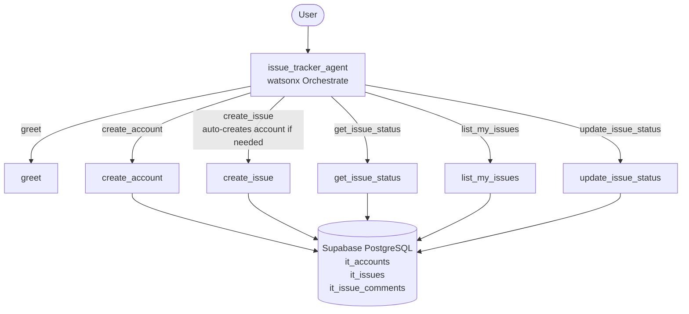

# Issue Tracker Agent

An IBM watsonx Orchestrate agent that lets users file, query, and manage
support issues entirely through a conversational interface.

---

## Architecture Overview



---

## Features

| Capability | Tool used |
|---|---|
| Greet a user | `greet` |
| Create a new account | `create_account` |
| File a new issue (auto-creates account if needed) | `create_issue` |
| Check the status of an issue | `get_issue_status` |
| List all issues filed by an email address | `list_my_issues` |
| Update the status of an existing issue | `update_issue_status` |

---

## Directory layout

```
issue_tracker/
├── agents/
│   └── issue_tracker_agent.yaml   ← Agent definition
├── tools/
│   ├── requirements.txt
│   ├── issue_tracker_tools.py     ← All tools in one file (alternative entry point)
│   └── issue_tracker/
│       ├── __init__.py
│       ├── create_account.py
│       ├── create_issue.py
│       ├── get_issue_status.py
│       ├── greet.py
│       ├── list_my_issues.py
│       └── update_issue_status.py
├── .env.example                   ← Copy to .env and fill in DATABASE_URL
├── import-all.sh                  ← One-shot import script
└── README.md
```

---

## Quick start

### 1. Install the CLI

Follow the [watsonx Orchestrate CLI installation guide](https://www.ibm.com/docs/en/watsonx/watson-orchestrate).

### 2. Activate your environment

```bash
orchestrate env activate <your-env-name>
```

### 3. Set your database URL

```bash
export DATABASE_URL="postgresql://postgres:<password>@<host>:5432/postgres"
```

If `DATABASE_URL` is not set, the import script will prompt you to enter it securely (input is hidden). The value is stored in WXO's credential vault — **it is never written to any file or environment variable on the server**.

### 4. Import everything

```bash
chmod +x import-all.sh
./import-all.sh
```

This registers all six Python tools and the agent in one shot.

---

## Tool reference

### `create_account(email, display_name?)`

Creates a new user account.  If an account for `email` already exists, the
existing account is returned with `already_existed = true`.

### `create_issue(email, title, description, priority?)`

Files a new issue.  **If no account exists for `email`, one is automatically
created** before the issue is recorded.  The response includes
`account_created: true` so the agent can inform the user.

Priority values: `low` | `medium` *(default)* | `high` | `critical`

### `get_issue_status(issue_identifier)`

Returns the current status and full details of a single issue.  The
`issue_identifier` can be either the human-readable number (e.g. `ISSUE-0001`)
or the internal UUID.

### `list_my_issues(email, status_filter?)`

Returns all issues filed by `email`, optionally filtered by status
(`open` | `in_progress` | `resolved` | `closed`).  Results are sorted
by creation date (most recent first).

### `update_issue_status(issue_identifier, new_status, comment?)`

Transitions an issue to a new status.  An optional `comment` is recorded
alongside the transition for audit purposes.

---

## Conversation examples

**Checking a non-existent account**
```
User:  Create an issue for jane.doe@example.com titled "Login page broken"
       with description "The login button does nothing on Chrome 124."
Agent: I have filed ISSUE-0001 for you. Since no account existed for
       jane.doe@example.com, I also created one automatically.
```

**Checking issue status**
```
User:  What is the status of ISSUE-0001?
Agent: ISSUE-0001 — "Login page broken"
       Status:   open
       Priority: medium
       Reporter: jane.doe@example.com
       Updated:  2025-07-01T10:23:45+00:00
```

**Updating a status**
```
User:  Please mark ISSUE-0001 as in_progress.
Agent: Done! ISSUE-0001 moved from open → in_progress.
```

---

## Sample prompts

**Greet the agent**
```
Hi, I'm Jane Doe
```

**Create a new account**
```
Create an account for jane.doe@example.com
```

**File a new issue**
```
Create an issue for jane.doe@example.com titled "Login page broken"
with description "The login button does nothing on Chrome 124."
```

**File a high-priority issue**
```
File a critical issue for ops@example.com — title: "Database down",
description: "Production database is unreachable since 09:00 UTC."
```

**Check issue status**
```
What is the status of ISSUE-0001?
```

**List all open issues**
```
Show me all open issues for jane.doe@example.com
```

**List issues with status filter**
```
List all in_progress issues for ops@example.com
```

**Update issue status**
```
Mark ISSUE-0001 as in_progress
```

**Close an issue with a comment**
```
Close ISSUE-0001 with the comment "Fix deployed to production in v2.3.1."
```

---

## Production notes

The tools connect to **Supabase PostgreSQL** and create the required tables
automatically on first use (`CREATE TABLE IF NOT EXISTS`).

To switch backends, update the `_conn()` function in each tool file (or in
`issue_tracker_tools.py`) to point at your preferred database — PostgreSQL,
MySQL, MongoDB, Jira REST API, GitHub Issues API, etc.
