# Creating an Agent through the Orchestrate UI

This walkthrough guides you through creating an AI agent directly inside the **watsonx Orchestrate** UI — no code, no IDE. You'll build a movie-booking assistant, connect it to the TicketTown MCP server, and deploy it live.

---

## Step 1 — Navigate to the Home Dashboard

When you open **watsonx Orchestrate**, you land on the **Home** dashboard.

This is the **control plane** — a dashboard that gives you a full picture of your agent landscape:

- Active agents and their deployment status
- Messages, feedback, and adoption metrics
- Agent evaluations and quality insights
- Needs attention panel with actionable alerts

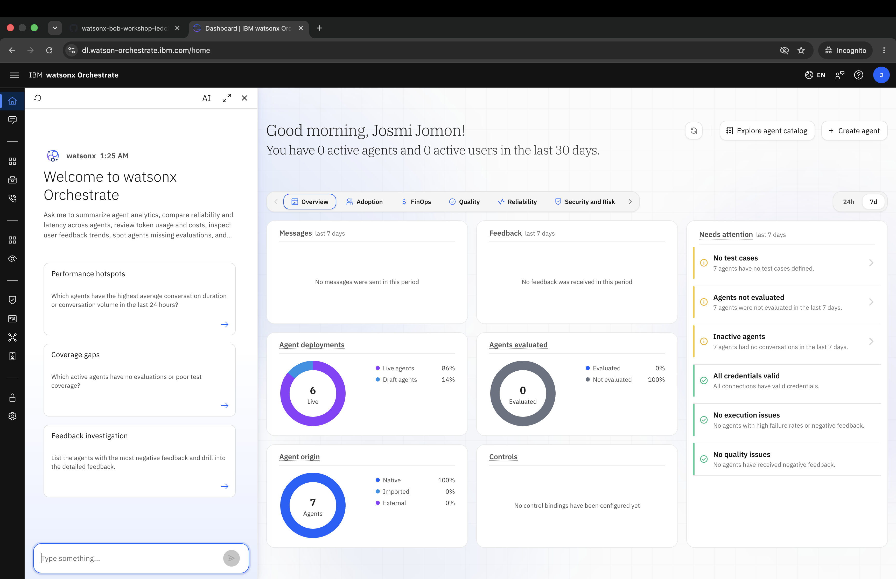

---

## Step 2 — Go to Chat and Create a New Agent

- Click **Chat** from the left navigation menu.
- You'll land on the **Chat** screen showing a **New chat** window.
- Scroll to the bottom of the left panel.
- Click **Create new agent**.

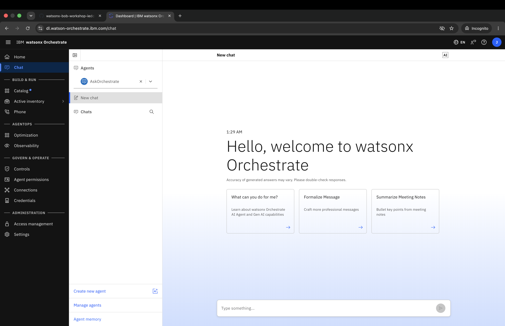

---

## Step 3 — Select "Create from Scratch"

A **Create an agent** modal appears with several options:

- **Build with AI (Bob)** — launches IBM Bob, your AI-powered coding partner.
- **Build from template** — start from a pre-built agent template.
- **Import LangGraph agent** — import an existing LangGraph agent.

For this walkthrough, click **Create from scratch** under **Other ways to start**.

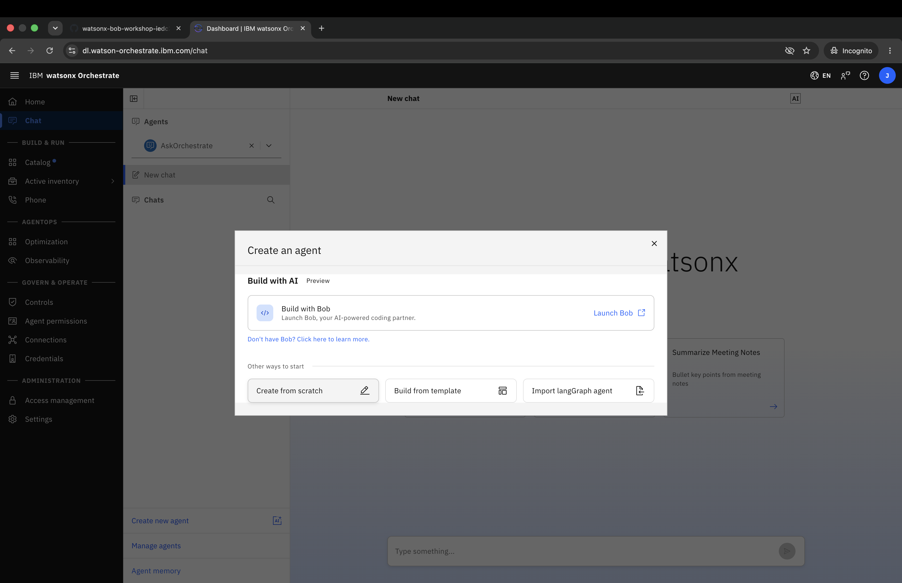

---

## Step 4 — Configure Your Agent's Profile and Instructions

You are now in the **Agent Builder**, on the **Build → Behavior** tab.

- Dismiss the **Legal Notice** after reading it.
- Under **Profile**, fill in:
  - **Agent name** — give your agent a name (e.g. `TicketTown Assistant`)
  - **Model** — leave the default (`GPT-OSS 120B — OpenAI via Groq`) or pick another from the dropdown
  - **Description** — write a short sentence describing what your agent does
  - **Instructions** — paste the rules that define how your agent behaves (see the instructions block in the previous guide for reference)

> The **Draft Preview** panel on the right lets you chat with your agent at any time while you build it — running in debug mode so you can test as you go.

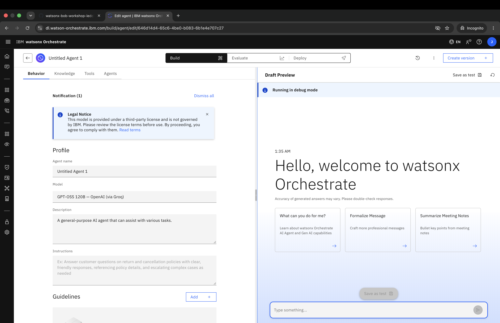

---

## Step 5 — Add Tools to Your Agent

- Switch to the **Tools** tab in the Agent Builder.
- Click **Add tool** — this opens the **Add a tool** modal.

You'll see several options:

**Create:**

- **Agentic workflow** — automate repeatable business processes with low-code workflows.
- **Build with Bob** — launch IBM Bob to create robust agentic solutions.

**Add from:**

- **Catalog** — choose from a catalog of existing tools.
- **Local instance** — choose from tools available on this instance.
- **MCP server** — import external tools from an MCP server.
- **OpenAPI** — import external tools from an OpenAPI file.

For this walkthrough, select **MCP server**.

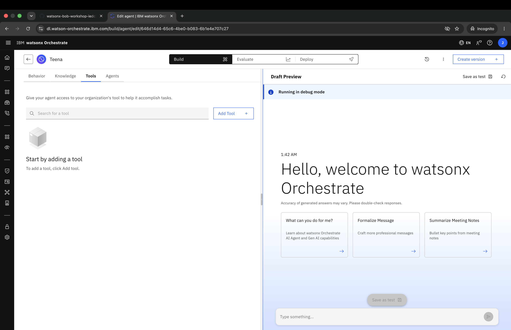
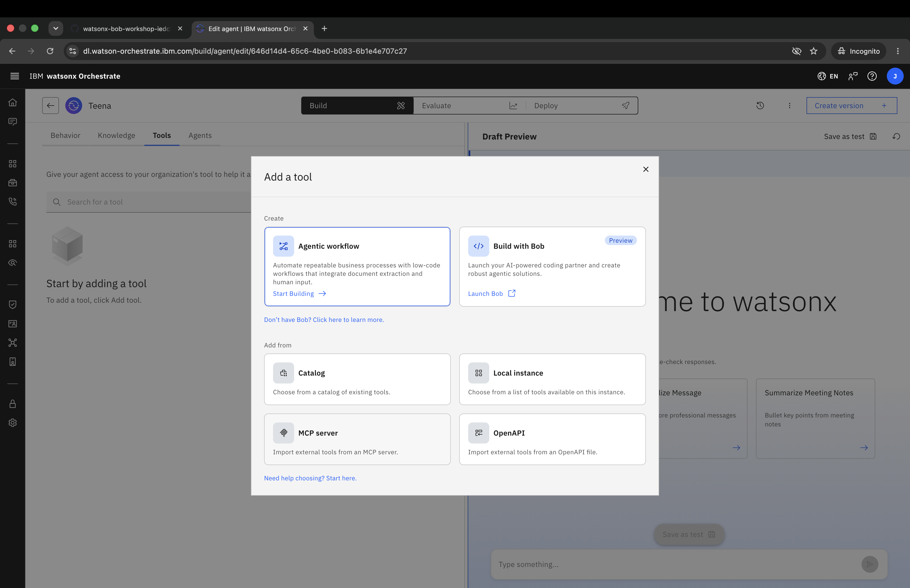

---

## Step 6 — Add an MCP Server

The **Add tools and manage MCP servers** panel opens. No MCP servers are connected yet.

- Click **Add MCP server +** in the top-right of the panel.

> This is where you import external tools from a Model Context Protocol (MCP) server and add them to your agent.

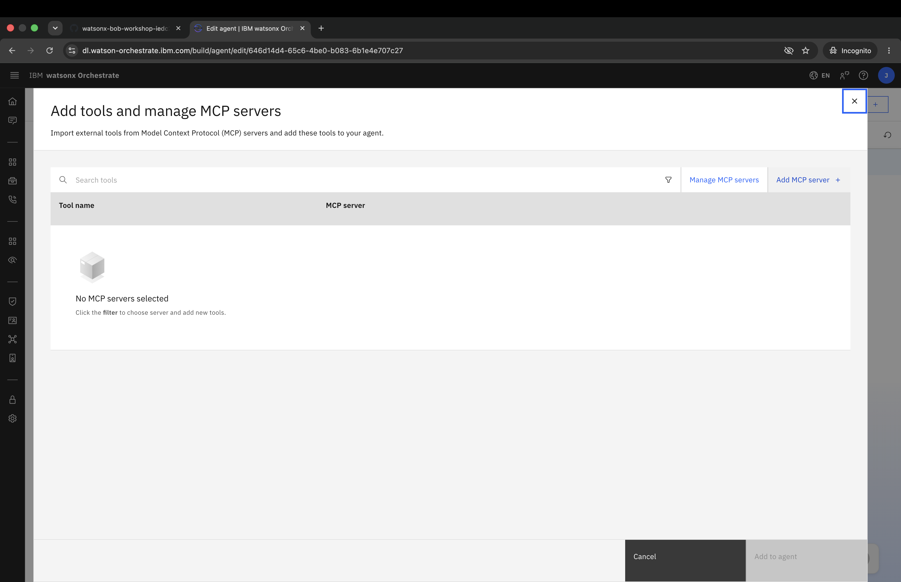

---

## Step 7 — Select Remote MCP Server

The **Add an MCP server** modal opens. You'll see two options:

- **Local MCP server** — installed and configured on your local system or network. Useful for accessing local services or files without external dependencies.
- **Remote MCP server** — an external server accessible over the internet, working like a standard web-based service.

Since the TicketTown MCP server is hosted online:

- Select **Remote MCP server**.
- Click **Next**.

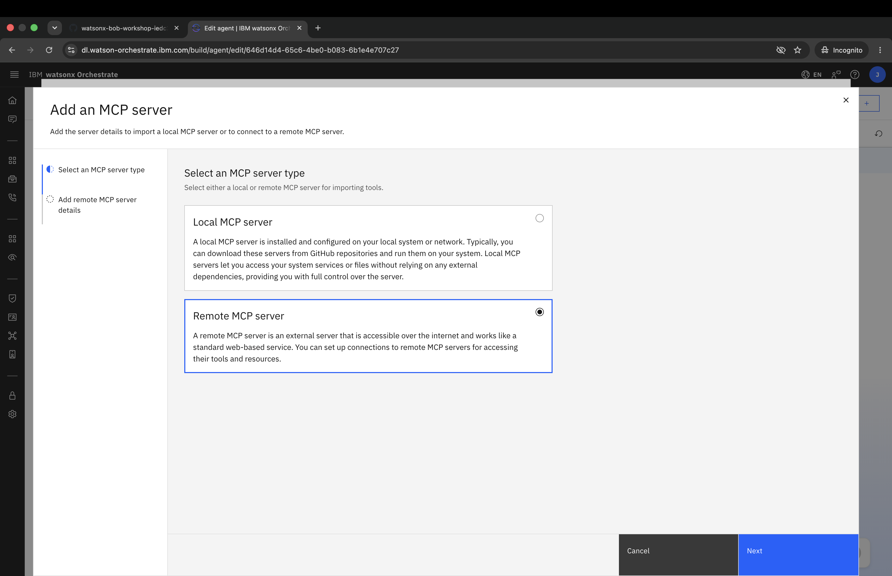

---

## Step 8 — Fill in the Remote MCP Server Details

Fill in the **Add remote MCP server details** form:

- **Server name** — give it a name (e.g. `MovieBooking`)
- **Description (optional)** — a short description (e.g. `Manages movie ticket booking and related activities.`)
- **MCP server URL** — copy and paste the URL below:

```
https://workshop-mcp.apps.wo-dp-005.p75g.p1.openshiftapps.com/mcp
```

- **Transport type** — select **Streamable HTTP**
- **Select Connection (Optional)** — leave as `None` (no API key required)

- Click **Connect**.
  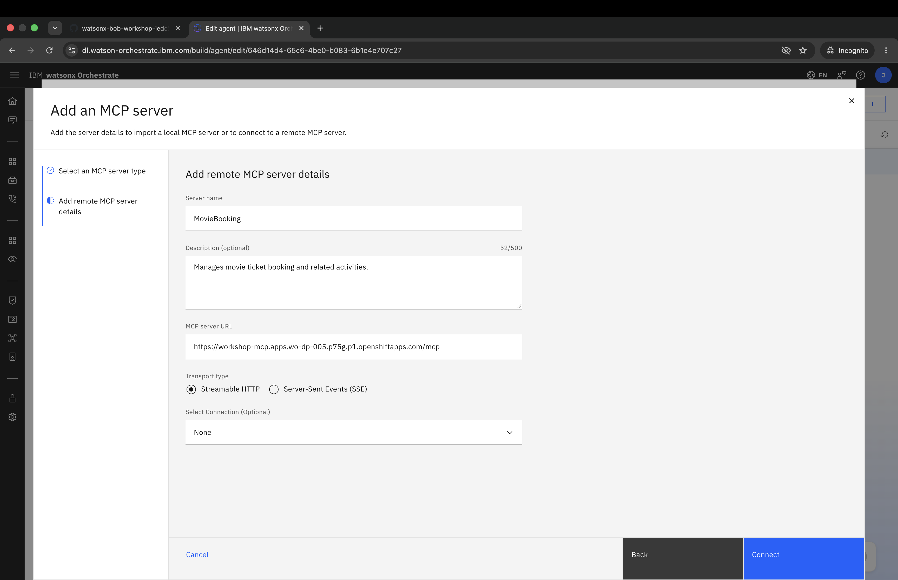

---

## Step 9 — Wait for the MCP Server to Connect

After clicking **Connect**, you'll see a loading state at the bottom of the form:

> _"Connecting to MCP server. This may take several minutes..."_

The **Connect** button changes to **Loading...** — wait for the connection to complete before proceeding.

> This is normal — the server is being reached and its available tools are being discovered.

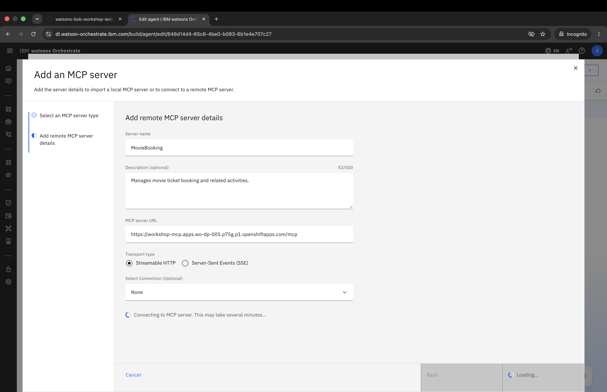

---

## Step 10 — Select All Tools and Add to Agent

Once connected, a green banner confirms:

> _"MCP server "MovieBooking" is ready. 12 tools from this MCP server are available to add to your agent."_

You'll see all tools listed under **MovieBooking (12)**:

- `get_showtimes` — List upcoming showtimes for a movie
- `get_showtimes_for_movie` — Fastest way to answer showtime queries
- `list_bookings` — List recent bookings for an email address
- `suggest_seats` — Find the best available seats together in one row
- _(and 8 more tools)_

- Select **all 12 tools** (the blue banner will show **12 tools selected**).
- Click **Add to agent**.
  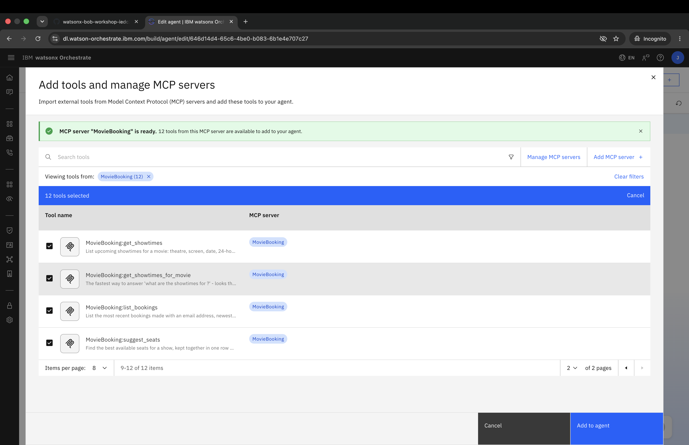
  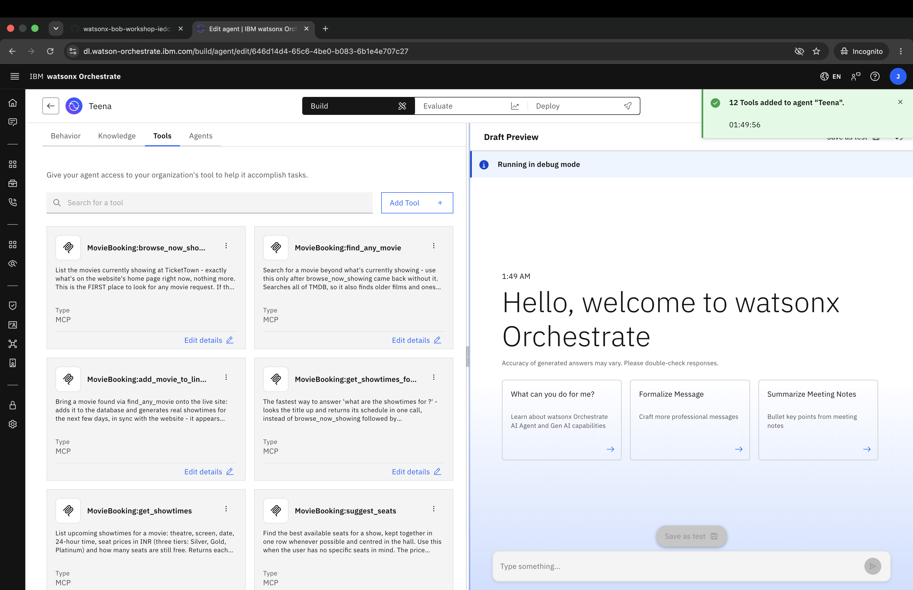

---

## Step 11 — Deploy the Agent to Live

- Navigate to the **Deploy** tab.
- Click **Deploy to Live**.

---

## Step 12 — Create a New Version

No versions exist yet. You can create and manage multiple versions and choose which one to deploy.

- Click **Create New Version**.

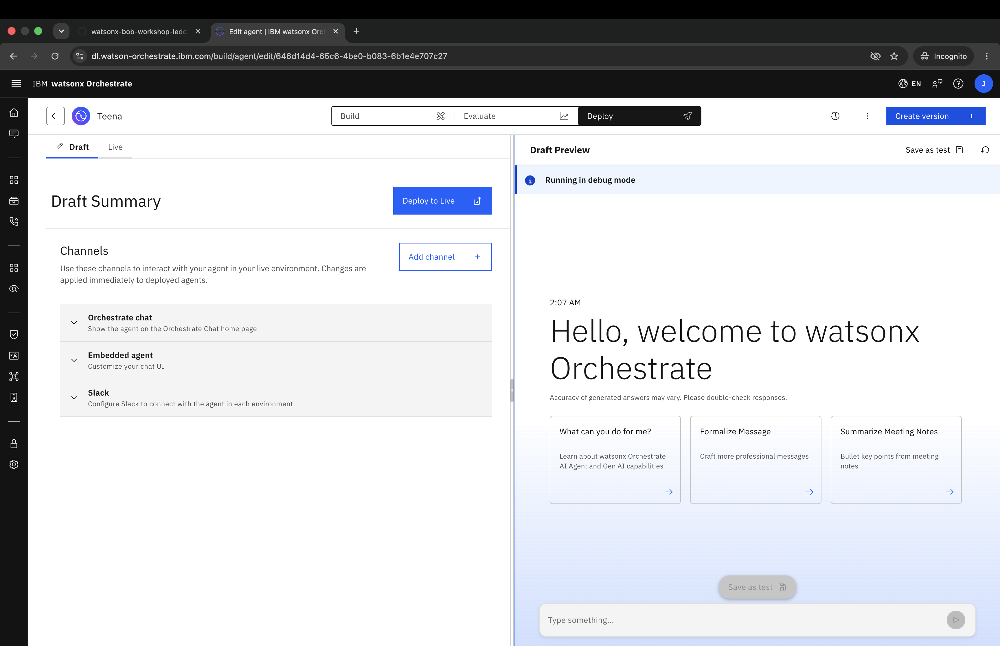

---

## Step 13 — Fill in Version Details

Provide the version details:

- **Version number** — must follow the `x.y.z` format (e.g. `1.0.0`)
- Everything else is up to you — name it and describe it however you like.

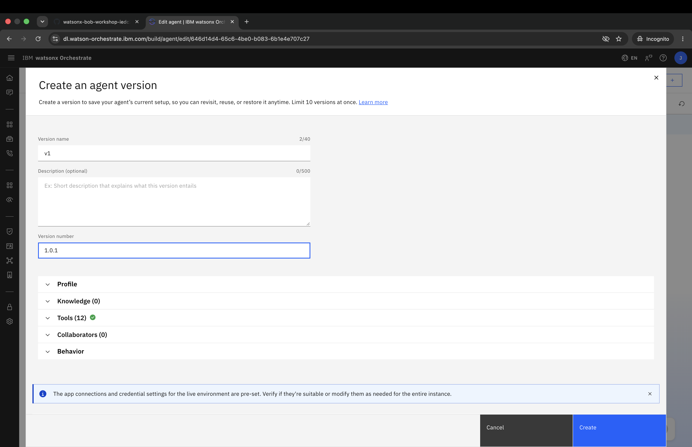

---

## Step 14 — Select the Version to Deploy

- Select the version you just created from the list.

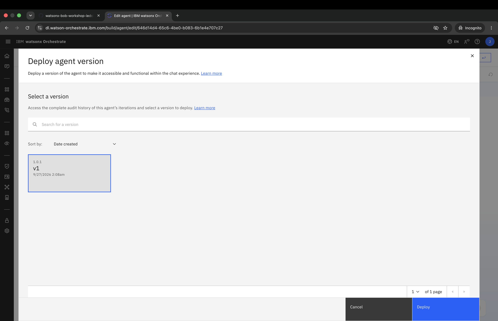

---

## Step 15 — Confirm Deployment

- Click **Deploy**.

---

## Step 16 — Wait for Deployment to Complete

The agent is now being deployed. This usually takes just a few seconds. Wait for the process to finish.

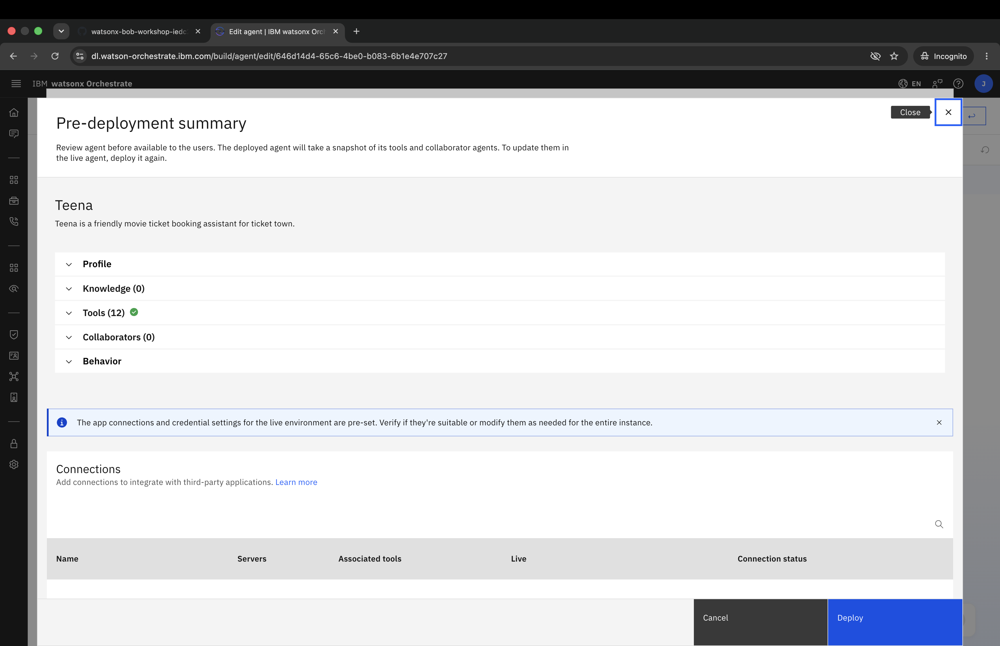

---

## Step 17 — Agent is Live!

Once deployed, you'll receive a **notification** confirming the deployment was successful.

- Navigate back to the **Chat** page.
- Search for your agent by name and select it.

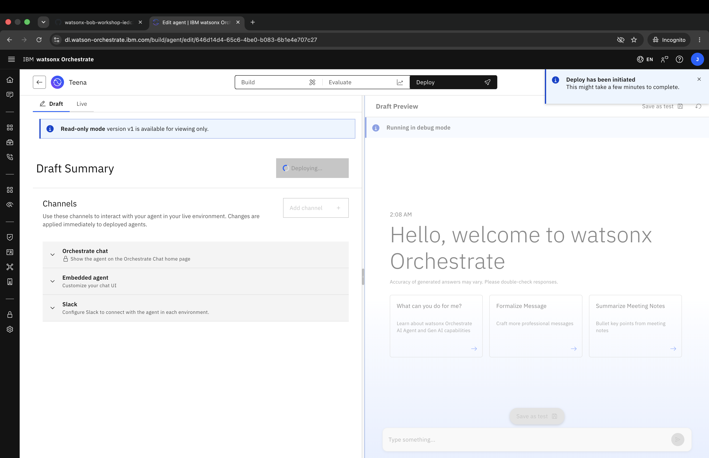

---

## 🎉 All Done!

Your agent is now live and ready to use. Go ahead and interact with it — test its capabilities, explore its tools, and see it in action.

---

_Happy building!_
